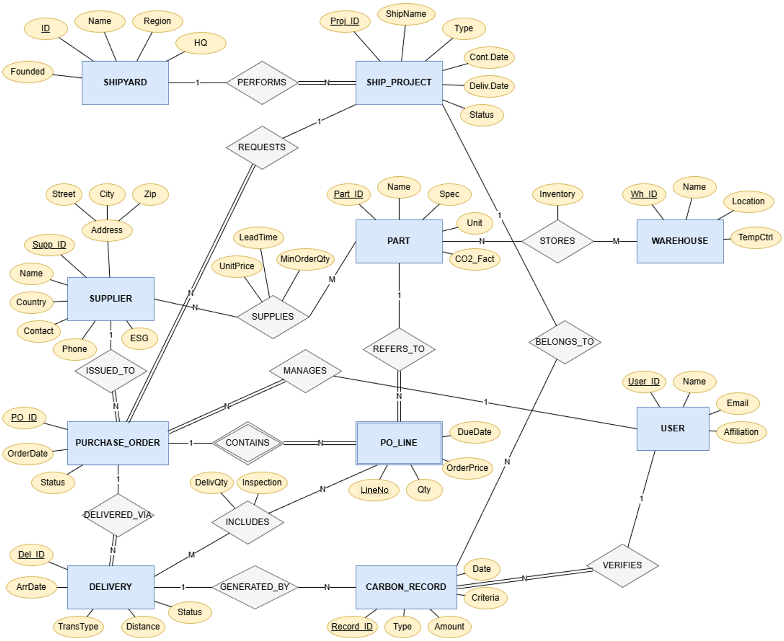
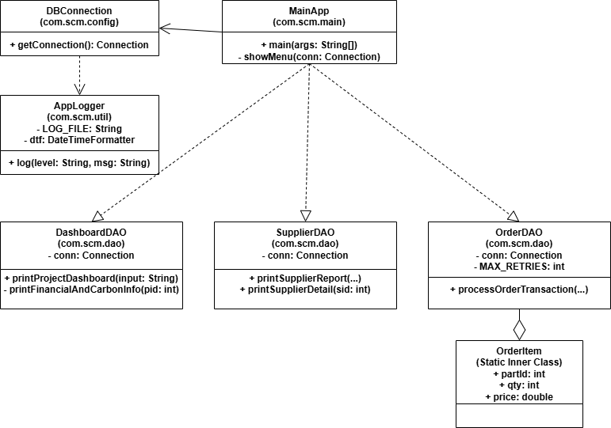

# 탄소중립 스마트 SCM 플랫폼 (smart-scm-app)

2025년 2학기 데이터베이스 과목 텀프로젝트로 수행한 **조선·해양 산업용 SCM + 탄소배출 통합 관리 콘솔 애플리케이션**입니다.  
HW9의 ER 모델링/관계 스키마 설계를 바탕으로, HW10에서 Java + PostgreSQL 기반 DB 응용프로그램으로 구현했습니다.

## 프로젝트 개요

- 프로젝트명: `smart-scm-app`
- 형태: Java 콘솔 애플리케이션
- 목표:
1. 프로젝트 대시보드(비용/탄소 집계) 조회
2. 발주-납품-재고 반영의 원자적 트랜잭션 처리
3. 공급업체 ESG/지연 납품 리포트 제공
4. 예외 처리, 로그, 설정 분리 구현

## 다이어그램

### ERD



### Class Diagram



## 주요 기능

### 1) 프로젝트 대시보드 및 탄소·비용 리포트
- 입력: 프로젝트 ID 또는 선박명 일부
- 출력:
1. 프로젝트 기본 정보
2. 총 발주 금액 (`SUM`, `JOIN`)
3. 공급업체별 발주 금액 Top 3 (`GROUP BY`, `ORDER BY`, `LIMIT`)
4. 운송/보관/전체 탄소배출 합 (`CASE WHEN`, `SUM`)
5. 탄소 집약도(kg CO2e / 백만 원)

구현 위치: `src/main/java/com/scm/dao/DashboardDAO.java`

### 2) 발주 + 초기 납품 + 재고 반영 트랜잭션
- 단일 트랜잭션으로 처리:
1. `PURCHASE_ORDER` 생성
2. `PO_LINE` 다건 생성
3. `DELIVERY` 초기 1건 생성
4. `INCLUDES`에 발주수량 50% 자동 입고
5. `STORES` 재고 Upsert (`ON CONFLICT DO UPDATE`)
- 예외 발생 시 전체 `ROLLBACK`, 성공 시 `COMMIT`
- PostgreSQL 데드락(`SQLState=40P01`) 최대 3회 재시도

구현 위치: `src/main/java/com/scm/dao/OrderDAO.java`

### 3) 공급업체 ESG 및 지연 납품 리포트
- 공급업체 목록:
1. 공급업체 ID/이름/국가/ESG
2. 총 발주 금액
3. 지연 납품 비율(지연건수/전체건수)
- 필터:
1. ESG 등급 다중 선택
2. 지연 납품 비율 구간(min/max)
- 상세 조회:
1. 특정 업체 최근 발주 5건
2. 발주 상태 + 지연 여부 요약

구현 위치: `src/main/java/com/scm/dao/SupplierDAO.java`

### 4) 예외 처리, 로그, 환경 설정
- 전역 예외 처리 및 사용자 친화 메시지 출력
- 콘솔 + 파일 로그(`scm_system.log`) 동시 기록
- DB 접속정보를 `db.properties`로 분리(하드코딩 방지)

구현 위치:
- `src/main/java/com/scm/main/MainApp.java`
- `src/main/java/com/scm/config/DBConnection.java`
- `src/main/java/com/scm/util/AppLogger.java`

## 기술 스택

- Language: `Java`
- Build: `Gradle Wrapper 9.0.0`
- DB: `PostgreSQL 18.0.1`
- JDBC Driver: `org.postgresql:postgresql:42.7.2`
- Test: `JUnit 5.10.0`

권장 개발 환경:
- JDK `17` 이상 (Gradle 9 요구사항 반영)
- IntelliJ IDEA

## 프로젝트 구조

```text
src/main
├─ java/com/scm
│  ├─ main/MainApp.java
│  ├─ config/DBConnection.java
│  ├─ util/AppLogger.java
│  └─ dao
│     ├─ DashboardDAO.java
│     ├─ OrderDAO.java
│     └─ SupplierDAO.java
└─ resources/db.properties
```

## 과제 요구사항 대응 방식 (기술적 해결)

- ER 모델의 1:N, N:M, 약한 엔티티(PO_LINE) 구조를 코드의 DAO 쿼리/트랜잭션 흐름에 반영
- 집계성 요구사항은 DB 레벨에서 처리:
1. `SUM`, `COUNT`, `CASE WHEN`, `GROUP BY`, `HAVING`, `JOIN`
- 발주 등록 전 과정을 하나의 ACID 트랜잭션으로 구현하고 실패 시 원자적으로 롤백
- 동시성 이슈 대응:
1. `READ_COMMITTED` 격리수준 설정
2. 데드락 재시도 로직으로 안정성 향상
- 운영성 확보:
1. 설정 파일 분리(`db.properties`)
2. 로그 분리(`AppLogger`, `scm_system.log`)

## 실행 방법

### 0) 사전 준비
1. JDK 17+ 설치
2. PostgreSQL 18.0.1 설치 및 실행
3. ERD(`docs/images/erd.png`)를 참고하여 과제 설계 기준의 스키마/테이블(13개) 사전 생성

### 1) 프로젝트 클론

```bash
git clone https://github.com/mseoky/smart-scm-app.git
cd smart-scm-app
```

### 2) DB 설정
`src/main/resources/db.properties`를 환경에 맞게 수정합니다.

```properties
db.host=localhost
db.port=5432
db.name=scmdb
db.user=scmuser
db.password=1234
```

### 3) IntelliJ IDEA에서 실행
1. IntelliJ IDEA 실행
2. `Open` → `smart-scm-app` 폴더 선택
3. Gradle Import 완료 대기
4. JDK를 17 이상으로 설정
5. 실행 구성에서 `com.scm.main.MainApp` 선택 후 Run

### 4) 터미널(Gradle)로 실행하는 방법
현재 `application` 플러그인이 설정되어 있지 않으므로 기본적으로 IntelliJ에서 `MainApp` 실행을 권장합니다.  
(필요 시 `build.gradle`에 `application` 플러그인과 `mainClass`를 추가해 CLI 실행 가능)

## 로그 및 설정 파일

- DB 설정: `src/main/resources/db.properties`
- 실행 로그: `scm_system.log`

## 참고

- 본 프로젝트는 데이터베이스 과목 과제 요구사항(HW9 모델링 + HW10 응용 구현)을 충족하도록 설계되었습니다.
- SQL 작성 문제 자체보다, 애플리케이션 코드 내 트랜잭션/집계/예외처리/리포트 구현에 초점을 두었습니다.
